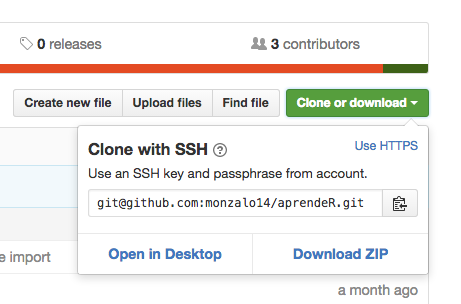

```{r setup, include=FALSE}
knitr::opts_chunk$set(echo = TRUE)
```

## Módulo 2: Manipulación

## Primera tarea

1. Instala y carga el paquete swirl()

```{r, include=T, eval=F}
install.packages("swirl")
library(swirl)
```

2. Encontrarás un menú de bienvenida. Introduce tu nombre (no es relevante si sólo queremos practicar un poco). 

3. Enseguida, swirl te pide que escojas un curso. El curso que queremos es **"Getting and Cleaning Data"**. En caso de que no lo veas en la lista de cursos a escoger, toma la opción **"Take me to the swirl course repository!"** y sigue las instrucciones del repositorio (debería de abrirse una pestaña de tu navegador con el repositorio de swirl. En caso de que no sea así, visita esta [liga](https://github.com/swirldev/swirl_courses) y sigue las instrucciones.

## Segunda tarea:

1. Revisa los ejemplos que tenemos en el archivo **manipulacion.Rmd** de manipulaciones utilizando el criterio de datos limpios. Si tienes cuenta en github, lo más fácil es que clones [el repositorio](github.com/monzalo14/aprendeR), pero si prefieres no hacerlo, sigue estas instrucciones:

2. Descarga un archivo .zip con todo el contenido del repo:

 

3. Descomprime el archivo (dependiendo de tu sistema operativo, tienes distintas opciones de descompresión).

4. Donde sea que vayas a poner la carpeta del repositorio en tu computadora, asegúrate de tener ese como directorio de trabajo, cuando hagas esta tarea:

```{r, include=T, eval=F}
setwd("/micarpeta/aprendeR/02_manipulacion")
```

Nota: En caso de que quieras más referencias sobre datos limpios, el paper de Tidy Data de Hadley Wickam está disponible [aquí](http://vita.had.co.nz/papers/tidy-data.pdf)
