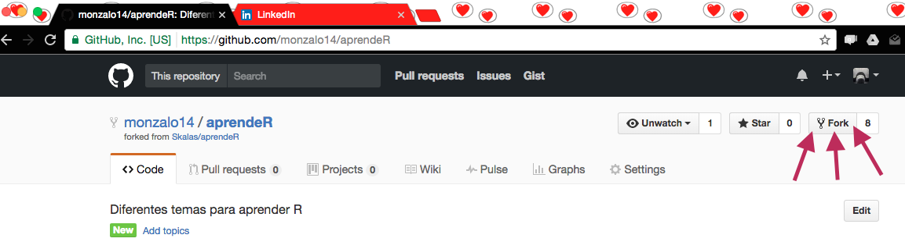
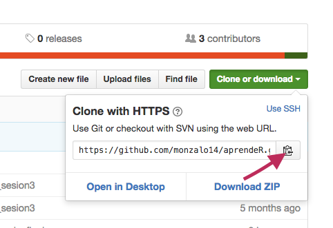
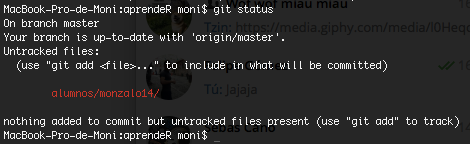
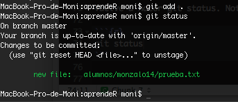
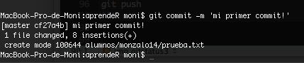
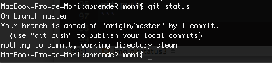
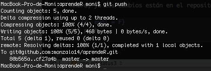
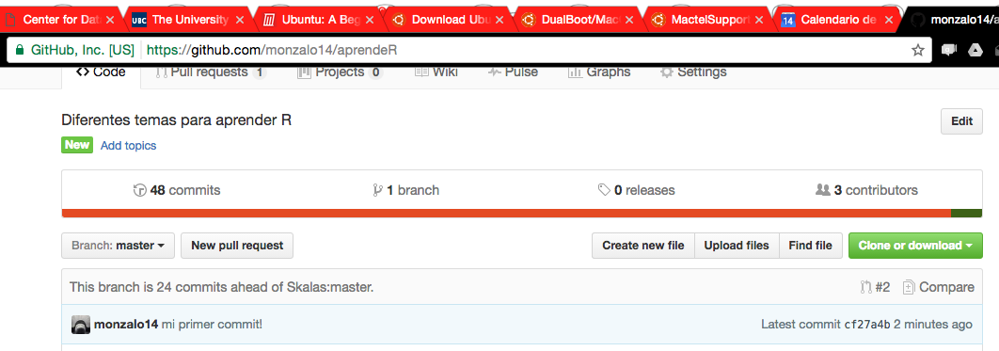

```{r setup, include=FALSE}
knitr::opts_chunk$set(echo = TRUE)
```

# Tarea 1
## Introducción a Git
#### Descarga Git

Puedes descargar git [aquí](https://git-scm.com/downloads)

#### Crea tu repositorio para hacer tareas

Primero, debes [crear tu cuenta de github](github.com). Vas a ver una pantalla así:

 

Escoge un nombre de usuario, escribe tu correo y contraseña.

Después, necesitas hacer un *fork* del repositorio de esta clase.

Ve a [el repo de la clase](https://github.com/monzalo14/aprendeR). Da click donde indica la flecha:  Esto te dará tu versión remota del repo. 

#### Clona tu repositorio para tenerlo en tu compu

Una vez que tengas **tu repo**, asegúrate de estar en su dirección remota: (**github.com/tunombredeusuario/aprendeR**) y clona tu repositorio: 

Copia el link dando click aquí:



En tu terminal (GitBash, para los compas de Windows), clona tu repo así:

```{r, eval = F}
git clone https://github.com/tunombredeusuario/aprendeR
```

Nota que necesitas estar **en la carpeta en la que quieres que se cree tu repo.** Es decir, `git clone` crea una carpeta en la que va a vivir tu repositorio local. Por ejemplo, si quieres que tu repositorio esté en "Documentos", asegúrate de estar en esa carpeta antes de hacer `git clone`. Cuando clones el repositorio, git creará una subcarpeta *Documentos/aprendeR*. 

Una vez que hayas hecho `git clone`... ¡Listo! Ya tienes un repositorio remoto (https://github.com/tunombredeusuario/aprendeR), y un repositorio local, que vive **sólo** en tu compu.
Ahora vamos a ver cómo hacemos cambios en el repositorio. 

#### Primeros cambios a nuestro repositorio

En tu terminal, cambia el directorio de trabajo a **aprendeR**, y crea un directorio /alumnos/tunombredeusuario:

```{r, eval = F}
cd aprendeR
mkdir alumnos/minombredeusuario
```

Crea un archivo de prueba:

```{r, eval = F}
touch prueba.txt
open prueba.txt
```

Escribe cualquier cosa y guárdalo.
Ahora, haz `git status` para ver lo que está pendiente:

```{r, eval = F}
git status
```

Deberías ver una pantalla como esta:



Debes de agregar tus cambios para que se suban al repositorio. Si quieres agregar todos los cambios, puedes hacer `git add .`, pero tienes que haber verificado bien que los quieres agregar todos (esto es útil cuando tienes muchos archivos).

```{r, eval = F}
git add prueba.txt
```

Vuelve a hacer git status. Nota cómo tu archivo ya se agregó a lo que se puede hacer commit:

```{r, eval = F}
git status
```



Luego, necesitas hacer commit para poder agregar tus cambios al repositorio local:

```{r, eval = F}
git commit -m 'mi primer commit'
```



Por último, verifica que ya no tienes nada pendiente de agregar:

```{r, eval = F}
git status
```



Ahora, ya tus cambios están en el repositorio local. Falta agregarlos al remoto. Para eso, hacemos

```{r, eval = F}
git push
```



Mira cómo ya está tu commit en el repositorio remoto:



¡Listo, lo tenemos sincronizado con nuestro repositorio remoto! 
En esta carpeta con tu nombre de usuario vas a hacer todas tus tareas. 

## Primer R script

Crea un nuevo **R Script** en RStudio, llamado **tarea_1.R**. Guárdalo en tu carpeta de alumna. 

### Primer ejercicio
1. Crea una lista con elementos **solamente numéricos**, de elementos y dimensiones que quieras. Utiliza la función `lapply()` para sacarle la media a cada uno de sus elementos. 
2. Reemplaza algunos componentes de los elementos de tu lista con datos faltantes, i.e. `NA`. Verifica que estos componentes de hecho sean `NA`. 
3. ¿Puedes encontrar una manera de sacarle la media a los elementos de tu lista que tienen datos faltantes?

### Segundo ejercicio
1. Crea un vector (o una matriz) de tipo `character`. 
2. Ponle nombres a sus columnas
3. Verifica qué elementos de la matriz cumplan alguna condición. Por ejemplo: ¿Cuántos elementos contienen la letra *'a'*? (tip: busca la ayuda de las funciones grep: teclea `?grep` en tu consola).
4. Selecciona alguna columna de la matriz:
  - Por sus índices
  - Por su nombre
  * Recuerda que, con las matrices, le tienes que decir a `R` qué filas vas a seleccionar, no sólo qué   columnas.


